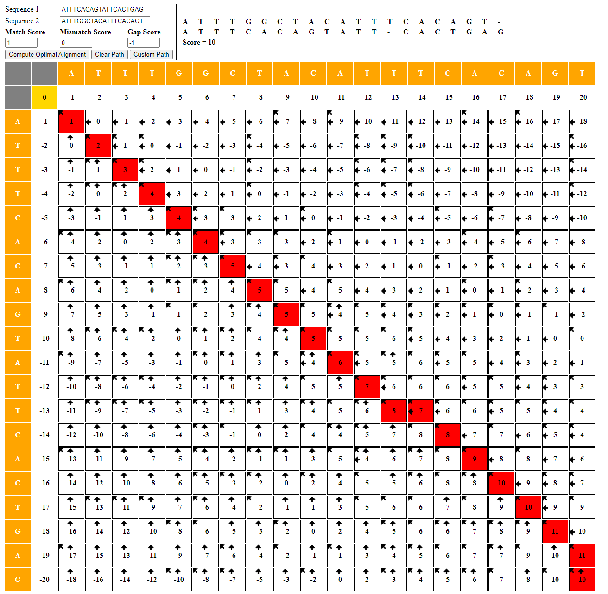
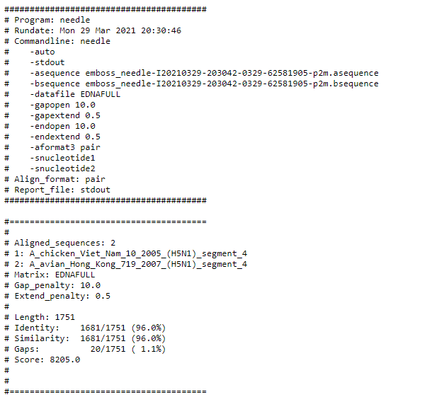
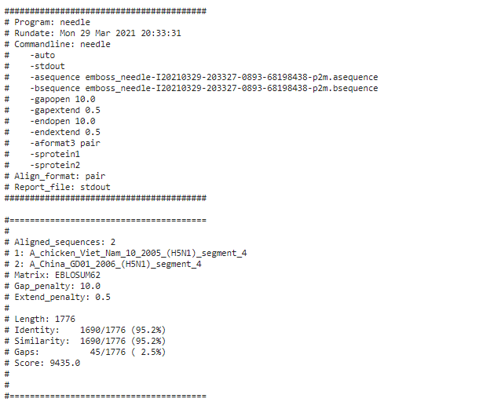
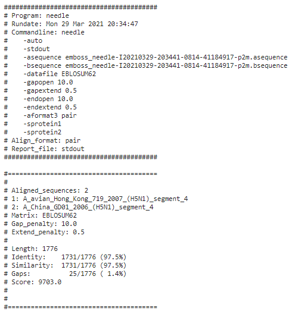

#### Name: Liam Connelly
#### Date: 29 March 2021
#### What this is: Questions in blue from the assignment sheet.

#### Part 1.

 1. Which software did you use to conduct your analysis?
 http://experiments.mostafa.io/public/needleman-wunsch/

 2. How similar were the two sequences (`s1.fasta` and `s2.fasta`) which you applied an alignment program?

 The two sequences had a score of 10.  This mean that the two sequences are very similar to each other.

 3. Are the two sequences closely related to each other, in your opinion?

 Yes, the two sequences are closely related to each other.  The only differences are a few mutations.

 4. What proof do you have to suggest such a claim?

 

#### Part 2
 1. How much similarity exists between each of the sequences to the others?
Vietnam and Hong Kong H5N1 had a similarity of 96%. Vietnam and China H5N1 had a similarity of 95.2%. Hong Kong and China H5N1 had a similarity of 97.5%.

 2. Based on your results so far (which are too few to provide a comprehensive study), do you believe there is evidence that human adaptation is occurring in H5N1 viruses that might merit concern about human-to-human transmission in the near future?
 Yes, I do see evidence of human adaptation in the H5N1 virus.  The DNA segments are very similar but not the same.  This indicates that it is slowly changing.  One of these ways it might change is human to human transmission.

 3. Statistics: What were the numbers of Lengths, Similarities, Gaps and Scores for each of your alignment tasks?

(Did you remember to add your name to this Markdown file?)
